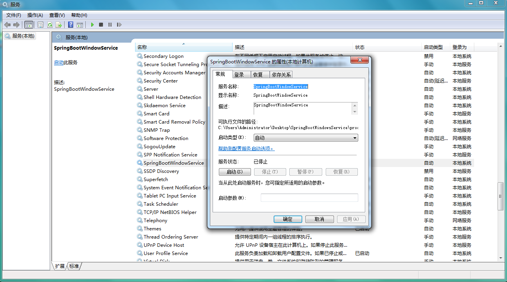

# SpringBootWindowsService

将Spring Boot应用注册为Windows服务。

# Screenshots

# 参考文档

http://javasampleapproach.com/java-integration/create-windows-service-spring-boot-application-procrun

https://commons.apache.org/proper/commons-daemon/procrun.html
